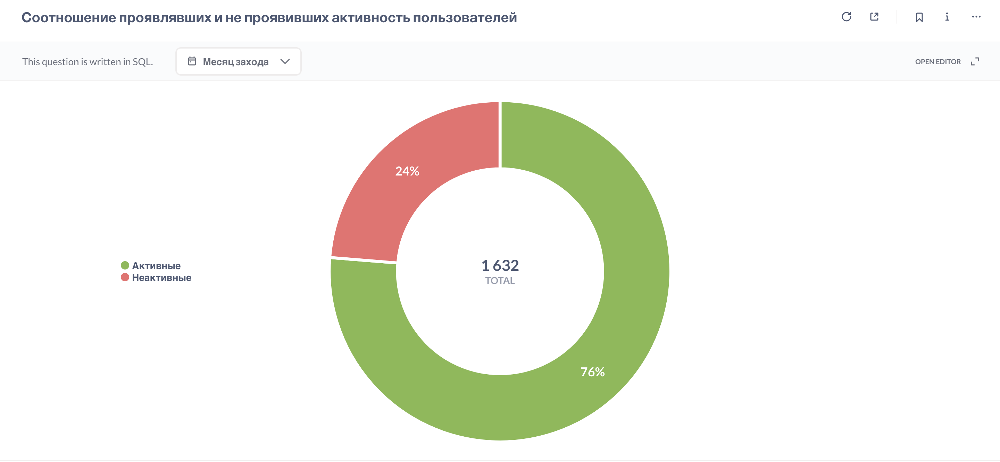

## **Соотношение активных и неактивных пользователей** 
Доля пользователей, которые зашли на платформу хотя бы 1 раз, но ни разу не совершили целевое действие (решение задачи, запуск теста, отправка кода), по сравнению с теми, кто проявил активность. Позволяет выявить "мертвый слой" аудитории - пользователей, которые регистрируются и заходят, но не доходят до первого целевого действия внутри платформы. 

[SQL-запрос](active-vs-inactive-users.sql)

**Результат:** 

### Вывод:
Почти каждый 4-й пользователь (23,71%) зашел хотя бы раз, но так и **не начал обучение** (решение задач/тестов). Такие пользователи практически **не имеют шансов удержаться**, так как не доходят до первого полезного действия. Это значит, что они искажают значения DAU, WAU, MAU (завышают их), но фактически не усиливают Retention, так как, скорее всего, они не возвращаются.

