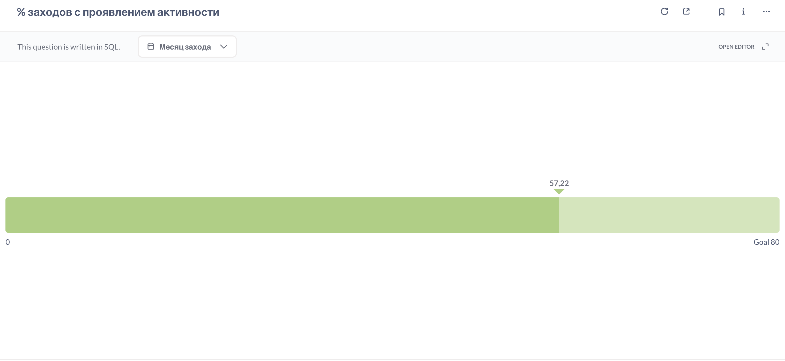

## **% входов на платформу с проявлением активности** 
Об активности сигнализируютт записи в таблицах CodeRun, CodeSubmit и TestStart за конкретный день: **решение задачи, отправка кода, запуск теста**. Метрика может сигнализировать о проблемах с навигацией на платформе или недостатке мотивации к выполнению заданий.

[SQL-запрос](activity-rate.sql)

**Результат:** 

### Вывод:
Почти **половина входов** (42,78%) **не сопровождается активностью** (решение задачи/теста). Это указывает на низкий уровень вовлеченности пользователей и сигнализирует о **необходимости улучшить удержание** или мотивировать пользователей выполнять действия на платформе (например, через геймификацию, подсказки или персонализированные рекомендации).

