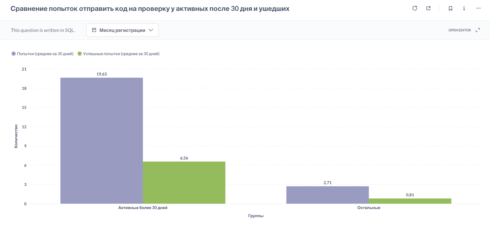

## **Поведение удержавшихся и ушедших (Rolling Retention 30-Day)** 
Сравнение активности по отправке кода (CodeSubmit) в первые 30 дней у 2 групп пользователей:
- Активные более 30 дней (последний заход ≥ 30 дней от даты регистрации)
- Остальные (ушли раньше)

Для каждой группы считаем за первые 30 дней **среднее количество отправок кода** и **среднее количество успешных решений**.
Первые 30 дней пользования продуктом с подписочной моделью — критический период формирования привычки.

### Метрика ответит на  вопросы:
> _**Как поведение удержавшихся пользователей отличается от остальных?**_
>  _**Есть ли поведенческие маркеры, которые связаны с долгосрочным удержанием?**_

[Код запроса](attempts-of-retained-vs-churned.sql)

**Результат:** 

### Выводы:
1. Среди всех пользователей ~10% удерживаются 30 и более дней.
2. Пользователи, оставшиеся активными на платформе 30 и более дней, в среднем примерно в 7 раз больше отправляли код на проверку, чем остальные. У них также примерно в 8 раз больше успешных попыток решить задачу, что говорит о позитивной роли успешных решений в поддержании мотивации и удержании пользователей.
