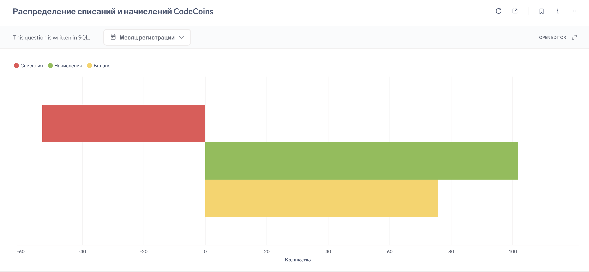

## **Распределение списаний и начислений CodeCoins** 
Средний объём начислений, списаний и итогового баланса внутренней валюты CodeCoins на одного пользователя.
### Метрика позволит ответить на вопрос:
> _**Работает ли внутренняя валюта как механизм мотивации и повторного вовлечения?**_

[Код запроса](codecoins-transactions.sql)

**Результат:** 

### Выводы:
1. Средний баланс положительный и достаточно высокий: пользователи больше накапливают, чем тратят.
2. Отсутствие регулярных списаний означает, что нет ценности, ради которой пользователи готовы тратить. Связь валюты с Retention слабая.
