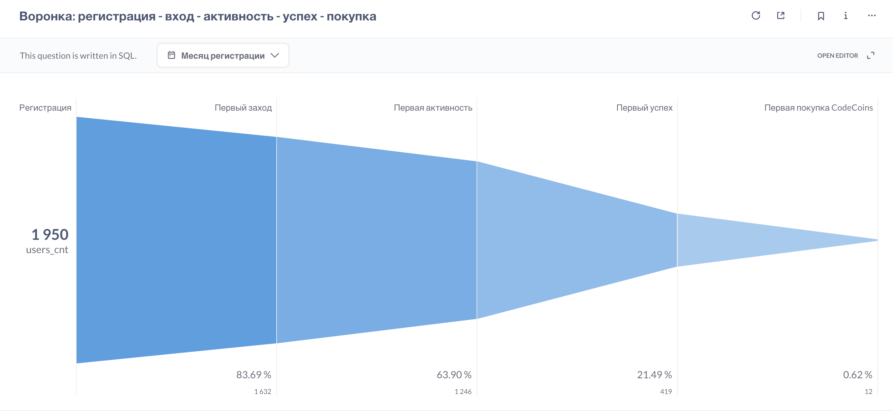

## **Воронка: регистрация - вход - активность - успех - покупка CodeCoins** 
Покажет, на каком этапе происходит отток пользователей.

[SQL-запрос](conversion-funnel.sql)

**Результат:** 

### Выводы:
1. Воронка значительно **сужается** на этапах **первого успеха** и **покупки**.
2. Почти 2/3 пользователей "отваливаются" на этапе первого успешного результата. Из **1246** проявлявших активность студентов **только 419 достигают успешной попытки** решить задачу. Если пользователь не достигает первого успешного результата, он с высокой вероятностью не перейдёт к платному действию.
3. **Конверсия до покупки** минимальна - **1%**. Из 1632 пользователей, совершивших вход на платформу, покупку совершают **только 12 человек**.

