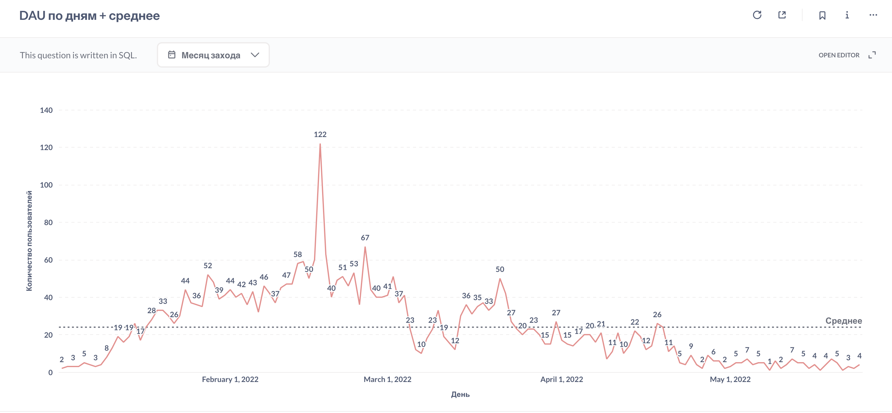
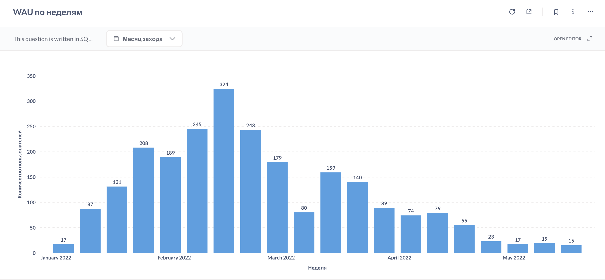
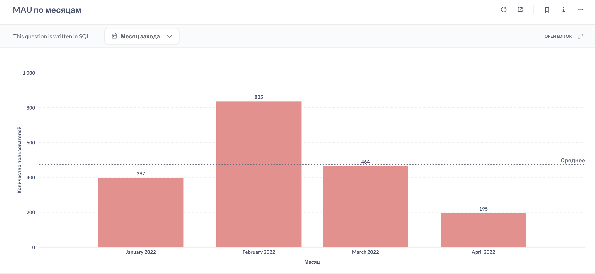

# DAU, WAU, MAU, Sticky Factor
Эти метрики позволяют оценить вовлеченность и активность пользователей платформы.

[Код запросов](dau-mau-wau.sql)

## DAU по заходам на платформу за весь период
### Динамика DAU по дням
**Результат:** 
 
> 12.03.22 отсутствуют заходы на платформу. Возможные причины: технические работы или сбой инфраструктуры. Требуется проверка логов.

### Статистика DAU:
- Среднее значение DAU
- Медианное значение DAU
- Перцентили:
    * P25 — нижний квартиль (дни низкой активности)
    * P75 — верхний квартиль (граница стабильной активности)
    * P90 — уровень пиковых нагрузок

#### Результат:

#### Выводы:

1. Ежедневно заходят на платформу в среднем около 24 человек из всех активных пользователей. Это **1,5%** (24 / 1632 * 100) - низкий показатель, говорящий о **низкой вовлечённости**.
2. Средний DAU (24) выше медианы (20), что указывает на **наличие пиковых дней активности**.
3. Распределение характеризуется **высокой волатильностью**: межквартильный диапазон (P25-P75) варьируется от **6 до 37 пользователей**.
4. P90 (47 пользователей) демонстрирует наличие **значительных всплесков** активности в отдельные дни, что может быть связано с **event-driven сценариями** использования продукта (дедлайны, рассылки, акции).
5. Таким образом, продукт демонстрирует **нестабильную активность**, отсутствие устойчивой ежедневной привычки у пользователей.

## WAU по заходам на платформу за весь период. Возьмем только недели, в которых было 5 и более дней в рамках периода.
### Динамика WAU по дням
**Результат:** 
 

### Статистика WAU:
- Среднее значение WAU
- Медианное значение WAU

#### Результат:

#### Выводы:
1. В среднем менее 8% всех активных пользователей (119 / 1632 * 100) возвращаются хотя бы раз в неделю.
2. Среднее (119) значительно выше медианы (88), что говорит о том, что распределение асимметрично и есть недели с аномально высокой активностью.
3. Таким образом, продукт не формирует устойчивый недельный паттерн использования. Активность носит событийный характер и зависит от внешних триггеров.

## MAU по заходам на платформу за весь период
### Динамика MAU по дням
**Результат:** 
 

#### Выводы:
1. В феврале наблюдается пиковое значение MAU - вдвое больше уникальных пользователей, чем в январе. Это коррелирует с большим количеством регистраций в феврале (757). Вероятно, проводилось активное привлечение новых пользователей.
2. К апрелю MAU падает почти в 4 раза по сравнению с февралем. Это снова коррелирует с небольшим кол-вом регистраций (107) и также говорит об оттоке тех, кто зарегистрировался ранее «не щедрого» на лидов апреля.

### Статистика MAU:
- Среднее значение MAU
- Медианное значение MAU

#### Результат:

#### Выводы:
1. Примерно 29% всей активной аудитории (1632) заходят на платформу хотя бы раз в месяц. То есть почти 70% пользователей не возвращаются в продукт в течение месяца.
2. Рост MAU обеспечивается преимущественно новыми регистрациями, а не лояльностью.
3. На момент анализа удержание аудитории недостаточно для устойчивой образовательной модели.

## Sticky Factor за весь период
Показывает, какая доля месячной аудитории использует платформу каждый день/неделю.

**Каждый день**:
Sticky Factor = Average DAU / Average MAU * 100 = 24 / 473 * 100 = **5,07%**

**Каждую неделю**:
Sticky Factor = Average WAU / Average MAU * 100 = 119 / 473 * 100 = **25,26%**

### Выводы:
1. Из всей месячной аудитории только 5% заходят ежедневно.
2. Только четверть месячной аудитории возвращается в течение недели
3. Регулярность использования платформы низкая, это говорит о том, что большинство пользователей заходят разово и у них не формируется устойчивая регулярная активность. Вероятно, отсутсвует ежедневная мотивация к возвращению пользователей.

